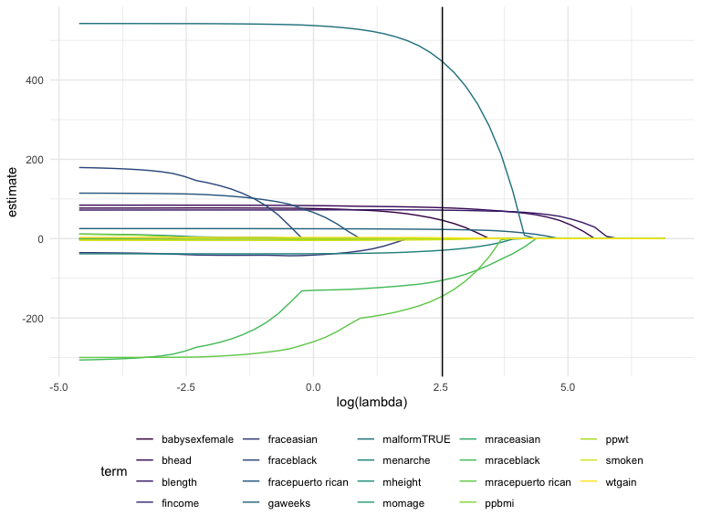
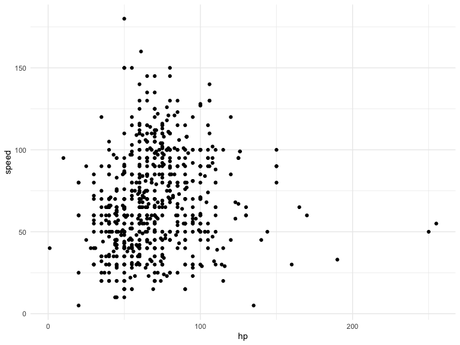
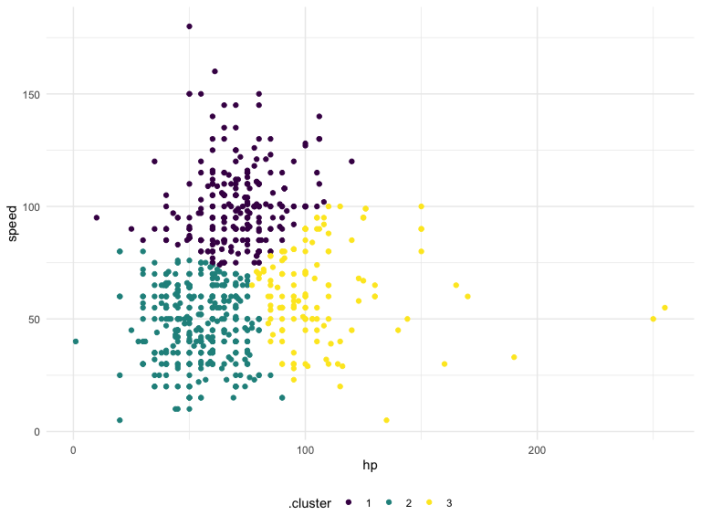

Statistical Learning
================

## Lasso

Predicting birthweight

``` r
bwt_df = 
  read_csv("extra_topic_data/birthweight.csv") %>%
  mutate(
    babysex = as.factor(babysex),
    babysex = fct_recode(babysex, "male" = "1", "female" = "2"),
    frace = as.factor(frace),
    frace = fct_recode(frace, "white" = "1", "black" = "2", "asian" = "3", 
                       "puerto rican" = "4", "other" = "8"),
    malform = as.logical(malform),
    mrace = as.factor(mrace),
    mrace = fct_recode(mrace, "white" = "1", "black" = "2", "asian" = "3", 
                       "puerto rican" = "4")) %>% 
  sample_n(200)
```

    ## Rows: 4342 Columns: 20

    ## ── Column specification ────────────────────────────────────────────────────────
    ## Delimiter: ","
    ## dbl (20): babysex, bhead, blength, bwt, delwt, fincome, frace, gaweeks, malf...

    ## 
    ## ℹ Use `spec()` to retrieve the full column specification for this data.
    ## ℹ Specify the column types or set `show_col_types = FALSE` to quiet this message.

Let’s just do the lasso and move on.

``` r
y = bwt_df %>% pull(bwt)
x = model.matrix(bwt ~ ., bwt_df)[, -1]
```

Let’s fit lasso.

``` r
lambda_grid = 10 ^ seq(3, -2, by = -0.1)

lasso_fit = glmnet(x, y, lambda = lambda_grid)

lasso_cv = cv.glmnet(x, y, lambda = lambda_grid)

lambda_opt = lasso_cv$lambda.min
```

Can we actually see what we did …?

``` r
lasso_fit %>% 
  broom::tidy() %>% 
  complete(term, lambda, fill = list(estimate = 0)) %>% 
  filter(term != "(Intercept)") %>% 
  ggplot(aes(x = log(lambda), y = estimate, group = term, color = term)) + 
  geom_path() +
  geom_vline(xintercept = log(lambda_opt ))
```



## Cluster pokemons

``` r
pokemon_df = 
  read_csv("extra_topic_data/pokemon.csv") %>% 
  janitor::clean_names() %>% 
  select(speed, hp)
```

    ## Rows: 800 Columns: 13

    ## ── Column specification ────────────────────────────────────────────────────────
    ## Delimiter: ","
    ## chr (3): Name, Type 1, Type 2
    ## dbl (9): #, Total, HP, Attack, Defense, Sp. Atk, Sp. Def, Speed, Generation
    ## lgl (1): Legendary

    ## 
    ## ℹ Use `spec()` to retrieve the full column specification for this data.
    ## ℹ Specify the column types or set `show_col_types = FALSE` to quiet this message.

Take a quick look at our pokemons

``` r
pokemon_df %>% 
  ggplot(aes(x = hp, y = speed)) + 
  geom_point()
```



Use K-means to identify clusters.

``` r
kmeans_fit = 
  kmeans(x = pokemon_df, centers = 3)
```

``` r
pokemon_df %>% 
  broom::augment(kmeans_fit, .) %>% 
  ggplot(aes(x = hp, y = speed, color = .cluster)) +
  geom_point()
```


